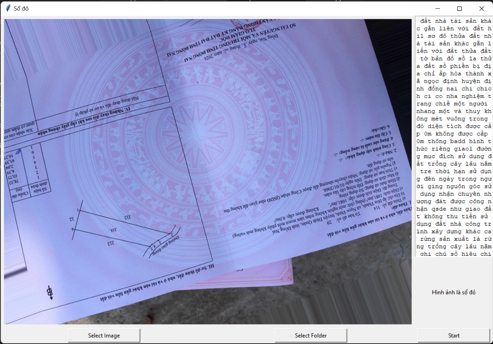

# Detect house ownership certificate
## Requirements
```
Python <= 3.7.9
```
## Install Dependencies
```
pip install -r requirements.txt
```
## Run app
```
python main.py
```
## UI


## User manual
### Image recognition
1. Click `Select Image` button.
2. Select image.
3. Click `start button`.
4. See result

### Folder filter
1. Click 'Select Folder' button.
2. Select image folder.
3. Click `start button`.
4. Select result folder.
5. See result.